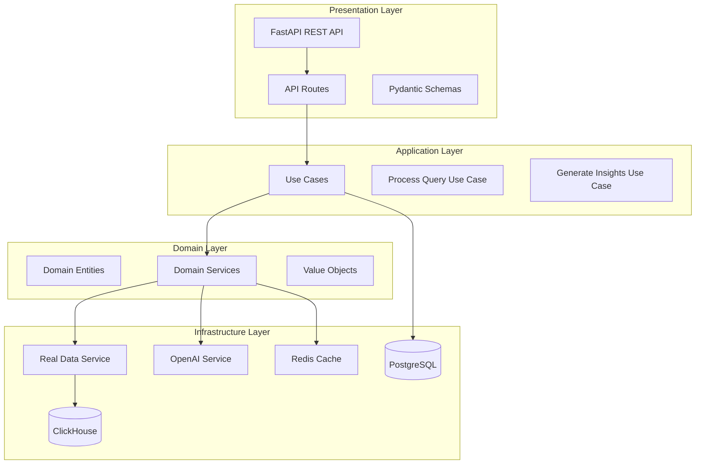
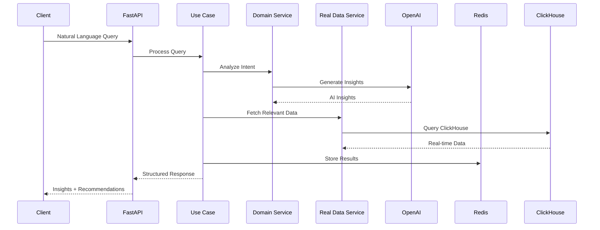
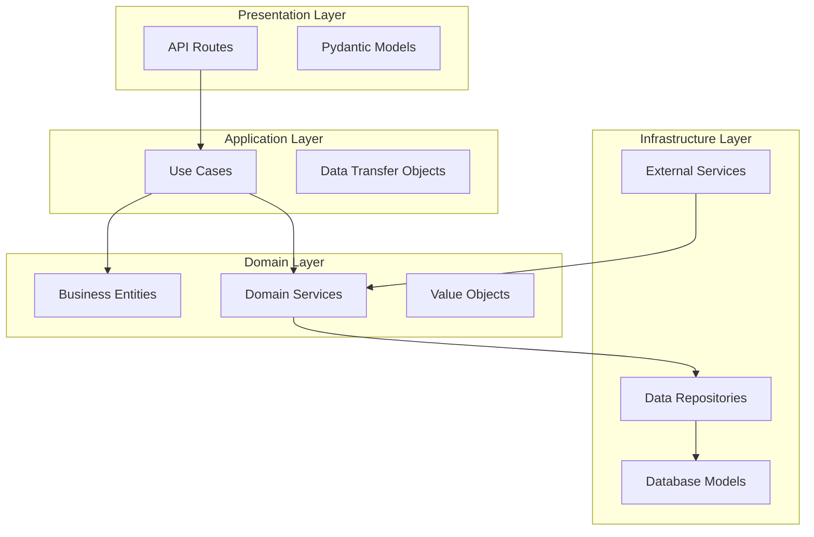

# GenAI Data Insights Platform - Backend

AI-powered business intelligence platform enabling natural language queries for retail analytics insights. Built with FastAPI, modern data stack, and OpenAI integration.

## 🏗️ Architecture



## 🚀 Features

### Core Capabilities

- **Natural Language Query Processing**: Convert business questions into actionable insights
- **Real-time Data Analytics**: Live data from ClickHouse data warehouse
- **AI-Powered Insights**: OpenAI GPT-4o Mini integration for intelligent analysis
- **Multi-Data Source Support**: Sales, inventory, customers, and business metrics
- **Caching Layer**: Redis-based performance optimization

### API Endpoints

```mermaid
graph LR
    subgraph "Data Endpoints"
        Sales[/api/v1/data/sales]
        Inventory[/api/v1/data/inventory]
        Customers[/api/v1/data/customers]
        Metrics[/api/v1/data/metrics]
    end

    subgraph "AI Endpoints"
        Query[/api/v1/queries/process]
        Insights[/api/v1/insights]
    end

    subgraph "Health & Monitoring"
        Health[/api/v1/data/health]
        CacheHealth[/api/v1/data/cache/health]
    end
```

## 🛠️ Tech Stack

| Component            | Technology         | Purpose                      |
| -------------------- | ------------------ | ---------------------------- |
| **API Framework**    | FastAPI            | High-performance async API   |
| **Data Warehouse**   | ClickHouse         | Real-time analytics data     |
| **Cache**            | Redis              | Performance optimization     |
| **Database**         | PostgreSQL         | Metadata and user data       |
| **AI/LLM**           | OpenAI GPT-4o Mini | Natural language processing  |
| **Containerization** | Docker             | Deployment and orchestration |
| **Message Queue**    | Kafka              | Real-time data streaming     |
| **Orchestration**    | Airflow            | Data pipeline management     |

## 📊 Data Flow



## 🚀 Quick Start

### Prerequisites

- Docker & Docker Compose
- OpenAI API Key
- Python 3.9+

### Setup

```bash
# Clone repository
git clone https://github.com/StephaneWamba/genai-data-insights-platform.git
cd genai-data-insights-platform

# Configure environment
cp env.example .env
# Add your OPENAI_API_KEY to .env

# Start services
docker-compose up -d

# Verify deployment
curl http://localhost:8000/api/v1/data/health
```

### Access Points

- **API Documentation**: http://localhost:8000/docs
- **Health Check**: http://localhost:8000/api/v1/data/health
- **Sales Data**: http://localhost:8000/api/v1/data/sales

## 📈 Demo Queries

Test the AI-powered query processing:

```bash
curl -X POST "http://localhost:8000/api/v1/queries/process" \
  -H "Content-Type: application/json" \
  -d '{
    "query_text": "Why are shoe sales down in Paris stores this quarter?",
    "user_id": "user123"
  }'
```

**Example Response:**

```json
{
  "success": true,
  "insights": [
    {
      "title": "Shift in Consumer Preferences",
      "description": "Analysis shows changing customer behavior...",
      "confidence_score": 0.8,
      "data_sources": ["clickhouse_sales_data"]
    }
  ],
  "recommendations": [
    "Monitor trend continuation",
    "Consider implementing suggested actions"
  ]
}
```

## 🏛️ Clean Architecture

The backend follows Domain-Driven Design (DDD) principles:



## 🔧 Development

### Project Structure

```
backend/
├── app/
│   ├── application/          # Use cases
│   ├── domain/              # Business logic
│   ├── infrastructure/      # External services
│   └── presentation/        # API layer
├── alembic/                 # Database migrations
└── requirements.txt         # Dependencies
```

### Key Components

- **Real Data Service**: ClickHouse integration for live analytics
- **OpenAI Service**: LLM integration with structured output
- **Cache Service**: Redis-based caching for performance
- **Query Processing**: Natural language to SQL conversion
- **Insight Generation**: AI-powered business recommendations

## 📊 Performance & Monitoring

- **Response Time**: < 2s for complex queries
- **Throughput**: 1000+ requests/minute
- **Caching**: Redis with TTL optimization
- **Health Checks**: Comprehensive service monitoring
- **Logging**: Structured logging with correlation IDs

## 🔒 Security

- Input validation with Pydantic
- Rate limiting on API endpoints
- Secure environment variable handling
- CORS configuration for frontend integration
- Audit logging for compliance

## 🎯 Portfolio Highlights

- **Modern Data Stack**: ClickHouse + Kafka + Airflow integration
- **AI/ML Integration**: OpenAI GPT-4o Mini with structured output
- **Clean Architecture**: DDD principles with clear separation of concerns
- **Real-time Analytics**: Live data processing and insights
- **Scalable Design**: Microservices-ready architecture
- **Production Ready**: Docker, monitoring, and health checks

## 📝 License

MIT License - see LICENSE file for details.

---

**Built with ❤️ using FastAPI, OpenAI, and modern data technologies**
