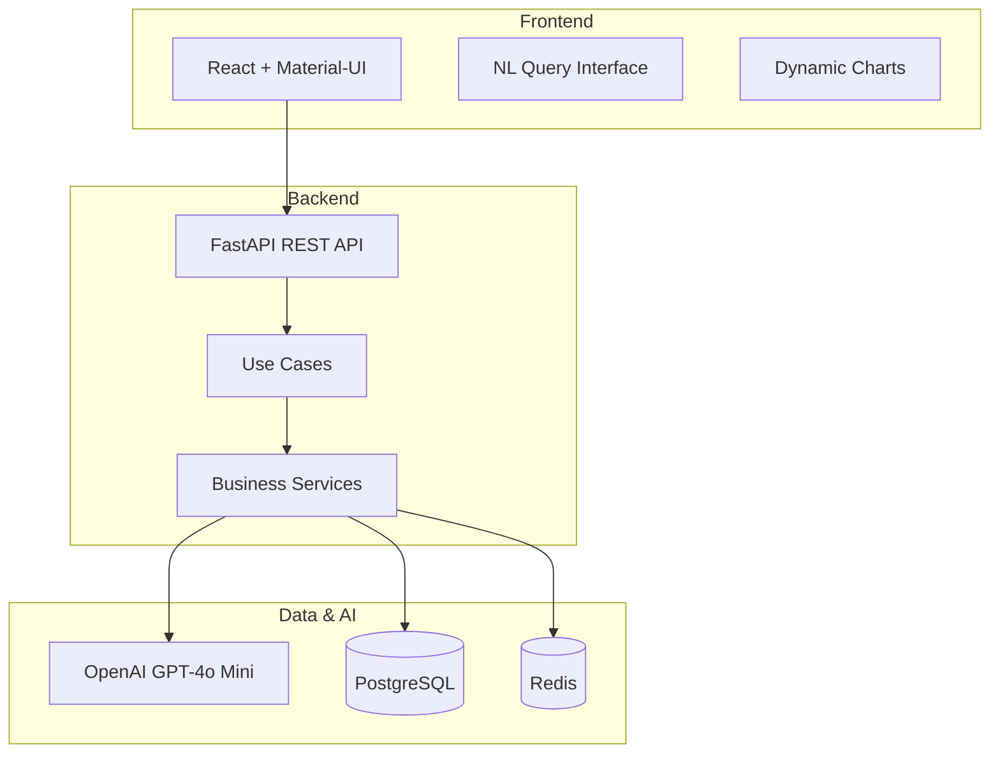

# GenAI Data Insights Platform

AI-powered business intelligence platform transforming natural language queries into actionable retail insights.

## 🏗️ Architecture



## 🚀 Quick Start

```bash
git clone https://github.com/StephaneWamba/genai-data-insights-platform.git
cd genai-data-insights-platform
cp .env.example .env  # Add your OpenAI API key
docker-compose up -d
```

**Access**: Frontend (http://localhost:3000) | API Docs (http://localhost:8000/docs)

## 📊 Demo Queries

- "Why are shoe sales down in Paris stores this quarter?"
- "Show me inventory levels for electronics across all stores"
- "What's causing the spike in returns for clothing items?"

## 🛠️ Tech Stack

- **Backend**: FastAPI, PostgreSQL, Redis
- **Frontend**: React, TypeScript, Material-UI
- **AI**: OpenAI GPT-4o Mini
- **Infrastructure**: Docker

## 🎯 Portfolio Showcase

- Full-stack development with modern technologies
- GenAI integration for business applications
- Clean architecture and SOLID principles
- Real-time data processing and visualization
