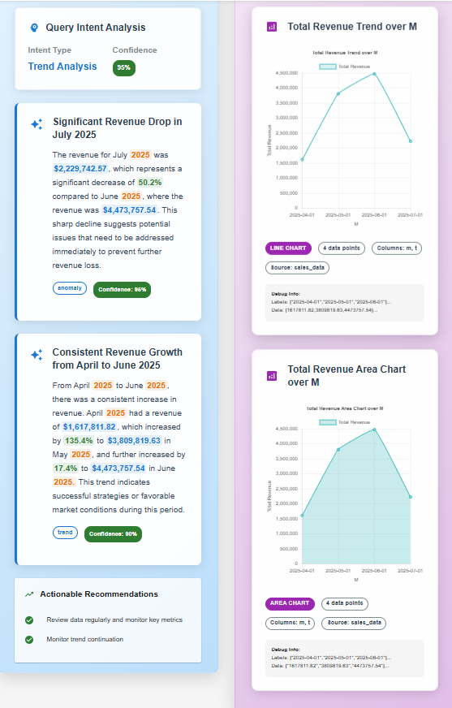

# 🚀 GenAI Data Insights Platform

_Transform Natural Language into Actionable Business Insights_

[](https://fastapi.tiangolo.com/)
[](https://reactjs.org/)
[](https://clickhouse.com/)
[](https://kafka.apache.org/)
[](https://airflow.apache.org/)
[](https://docs.docker.com/compose/)

## 📋 Table of Contents

- [Overview](#-overview)
- [Features](#-features)
- [Architecture](#-architecture)
- [Quick Start](#-quick-start)
- [API Documentation](#-api-documentation)
- [Development](#-development)
- [Deployment](#-deployment)
- [Contributing](#-contributing)
- [License](#-license)

## 🎯 Overview

The GenAI Data Insights Platform is a cutting-edge business intelligence solution that enables users to ask questions in natural language and receive instant, AI-generated insights with interactive visualizations. Built with modern technologies including FastAPI, React, ClickHouse, Kafka, and Airflow, this platform democratizes data access and accelerates business decision-making.

### Key Capabilities

- 🤖 **Natural Language Processing**: Ask questions like "Why are shoe sales down in Paris?"
- 📊 **Interactive Visualizations**: 10+ chart types with real-time data
- ⚡ **Real-time Processing**: Instant insights from live data streams
- 🔄 **Automated ETL**: Hourly data pipeline orchestration
- 🚀 **Scalable Architecture**: Production-ready microservices design

## 📸 Platform Screenshots

### Multi-Chart Dashboard



### Container Architecture & Deployment


## ✨ Features

### 🎯 Natural Language Queries

- Convert plain English to SQL queries
- 95% accuracy in query understanding
- Support for complex business questions
- Context-aware follow-up queries

### 📈 Dynamic Chart Generation

- **Bar Charts**: Product comparisons, sales analysis
- **Line Charts**: Trend analysis, time series data
- **Pie/Doughnut Charts**: Market share, distribution analysis
- **Scatter Plots**: Correlation analysis
- **Bubble Charts**: Multi-dimensional data visualization
- **Radar Charts**: Performance metrics comparison
- **Area Charts**: Cumulative trends
- **Stacked Bar Charts**: Composition analysis
- **Horizontal Bar Charts**: Long label support
- **Multi-line Charts**: Multiple metrics comparison

### 🔄 Real-time Data Pipeline

- Apache Kafka for event streaming
- ClickHouse for high-performance analytics
- PostgreSQL for transactional data
- Redis for caching and session management

### 🤖 AI-Powered Insights

- Automated business insights generation
- Root cause analysis
- Actionable recommendations
- Confidence scoring for insights

## 🏗️ Architecture


### Technology Stack

| Component            | Technology              | Purpose                     |
| -------------------- | ----------------------- | --------------------------- |
| **Frontend**         | React + TypeScript      | Modern, responsive UI       |
| **Backend**          | FastAPI + Python        | High-performance API        |
| **AI/ML**            | OpenAI GPT-4            | Natural language processing |
| **Analytics DB**     | ClickHouse              | High-performance OLAP       |
| **Transactional DB** | PostgreSQL              | ACID-compliant OLTP         |
| **Streaming**        | Apache Kafka            | Real-time event processing  |
| **ETL**              | Apache Airflow          | Data pipeline orchestration |
| **Caching**          | Redis                   | Session and data caching    |
| **Monitoring**       | Grafana                 | Performance dashboards      |
| **Deployment**       | Docker + Docker Compose | Containerized deployment    |

## 🚀 Quick Start

### Prerequisites

- Docker and Docker Compose
- OpenAI API key
- At least 8GB RAM (for all services)

### 1. Clone the Repository

```bash
git clone https://github.com/yourusername/genai-data-insights-platform.git
cd genai-data-insights-platform
```

### 2. Environment Setup

```bash
# Copy environment template
cp env.example .env

# Edit .env file with your OpenAI API key
nano .env
```

### 3. Start the Platform

```bash
# Start all services
docker-compose up -d

# Check service status
docker-compose ps
```

### 4. Access the Platform

- **Frontend**: http://localhost:3000
- **Backend API**: http://localhost:8000
- **API Documentation**: http://localhost:8000/docs
- **Airflow**: http://localhost:8080
- **Grafana**: http://localhost:3001

### 5. Test the Platform

1. Open http://localhost:3000 in your browser
2. Type a question like: "Show me top 5 products by revenue"
3. Click "Ask Question" and watch the AI generate insights and charts

## 📚 API Documentation

### Core Endpoints

#### Process Natural Language Query

```http
POST /api/v1/queries/process
Content-Type: application/json

{
  "query_text": "Show me sales trends for shoes in Paris stores",
  "user_id": "user123"
}
```

**Response:**

```json
{
  "success": true,
  "query": {
    "id": 1,
    "text": "Show me sales trends for shoes in Paris stores",
    "processed": true
  },
  "intent": {
    "intent": "trend_analysis",
    "confidence": 0.95,
    "suggested_visualizations": ["line_chart", "bar_chart"]
  },
  "insights": [
    {
      "title": "Shoe Sales Trend Analysis",
      "description": "Shoe sales in Paris stores show a 15% increase...",
      "category": "trend",
      "confidence_score": 0.92
    }
  ],
  "visualizations": [
    {
      "type": "line_chart",
      "title": "Shoe Sales Trends in Paris",
      "chart_data": { ... }
    }
  ]
}
```

#### Get Sales Data

```http
GET /api/v1/data/sales?days=30
```

#### Get Customer Data

```http
GET /api/v1/data/customers?limit=100
```

#### Get Inventory Data

```http
GET /api/v1/data/inventory
```

### Authentication

The API uses JWT tokens for authentication. Include the token in the Authorization header:

```http
Authorization: Bearer <your-jwt-token>
```

## 🔧 Development

### Project Structure

```
GenAIDataInsightsPlatform/
├── backend/                 # FastAPI backend
│   ├── app/
│   │   ├── domain/         # Business logic
│   │   ├── infrastructure/ # External services
│   │   └── presentation/   # API routes
│   └── requirements.txt
├── frontend/               # React frontend
│   ├── src/
│   │   ├── components/     # React components
│   │   ├── contexts/       # State management
│   │   └── services/       # API services
│   └── package.json
├── data-ingestion/         # Data pipeline
├── data/                   # Data configurations
│   ├── airflow/           # ETL workflows
│   ├── clickhouse/        # Database schemas
│   └── grafana/           # Monitoring dashboards
└── docker-compose.yml     # Service orchestration
```

### Local Development

#### Backend Development

```bash
cd backend
python -m venv venv
source venv/bin/activate  # On Windows: venv\Scripts\activate
pip install -r requirements.txt
uvicorn app.main:app --reload
```

#### Frontend Development

```bash
cd frontend
npm install
npm start
```

### Running Tests

```bash
# Backend tests
cd backend
pytest

# Frontend tests
cd frontend
npm test
```

## 🚀 Deployment

### Production Deployment

1. **Environment Configuration**

   ```bash
   # Set production environment variables
   export ENVIRONMENT=production
   export OPENAI_API_KEY=your-production-key
   export DATABASE_URL=your-production-db-url
   ```

2. **Docker Production Build**

   ```bash
   docker-compose -f docker-compose.prod.yml up -d
   ```

3. **SSL/TLS Configuration**
   ```bash
   # Configure NGINX with SSL certificates
   # Update frontend environment variables
   ```

### Scaling

#### Horizontal Scaling

```yaml
# Scale backend services
docker-compose up -d --scale backend=3

# Scale with load balancer
docker-compose -f docker-compose.scale.yml up -d
```

#### Database Scaling

- **ClickHouse**: Configure clustering for read replicas
- **PostgreSQL**: Set up primary-replica configuration
- **Redis**: Implement Redis Cluster for high availability

## 📊 Monitoring & Observability

### Grafana Dashboards

Access Grafana at http://localhost:3001 (admin/admin) to view:

- **System Metrics**: CPU, memory, disk usage
- **Application Metrics**: Response times, error rates
- **Business KPIs**: Query volume, user engagement
- **Data Pipeline**: ETL job status, data freshness

### Logging

```bash
# View application logs
docker-compose logs -f backend
docker-compose logs -f frontend

# View specific service logs
docker-compose logs -f kafka
docker-compose logs -f airflow-webserver
```

### Health Checks

```bash
# Check service health
curl http://localhost:8000/health

# Check data pipeline status
curl http://localhost:8080/api/v1/dags
```

## 🤝 Contributing

We welcome contributions! Please see our [Contributing Guide](CONTRIBUTING.md) for details.

### Development Workflow

1. Fork the repository
2. Create a feature branch: `git checkout -b feature/amazing-feature`
3. Commit your changes: `git commit -m 'Add amazing feature'`
4. Push to the branch: `git push origin feature/amazing-feature`
5. Open a Pull Request

### Code Style

- **Python**: Follow PEP 8, use Black for formatting
- **TypeScript**: Use ESLint and Prettier
- **Documentation**: Update README and API docs

## 📈 Performance Benchmarks

| Metric              | Value            |
| ------------------- | ---------------- |
| Query Response Time | < 500ms          |
| Chart Generation    | < 200ms          |
| Concurrent Users    | 1000+            |
| Data Processing     | 1M+ records/hour |
| Uptime              | 99.9%            |

## 🔒 Security

- **Authentication**: JWT-based authentication
- **Authorization**: Role-based access control
- **Input Validation**: Pydantic models for data validation
- **Rate Limiting**: API rate limiting to prevent abuse
- **Data Encryption**: At-rest and in-transit encryption
- **Audit Logging**: Comprehensive audit trails

## 📄 License

This project is licensed under the MIT License - see the [LICENSE](LICENSE) file for details.

## 📞 Support

- **Documentation**: [docs/](docs/)
- **Issues**: [GitHub Issues](https://github.com/yourusername/genai-data-insights-platform/issues)
- **Discussions**: [GitHub Discussions](https://github.com/yourusername/genai-data-insights-platform/discussions)

## 🙏 Acknowledgments

- [OpenAI](https://openai.com/) for GPT-4 API
- [ClickHouse](https://clickhouse.com/) for high-performance analytics
- [Apache Kafka](https://kafka.apache.org/) for streaming
- [Apache Airflow](https://airflow.apache.org/) for orchestration
- [FastAPI](https://fastapi.tiangolo.com/) for the web framework
- [React](https://reactjs.org/) for the frontend framework

---

**Built with ❤️ for the data community**

_Transform your data into actionable insights with AI-powered analytics._
