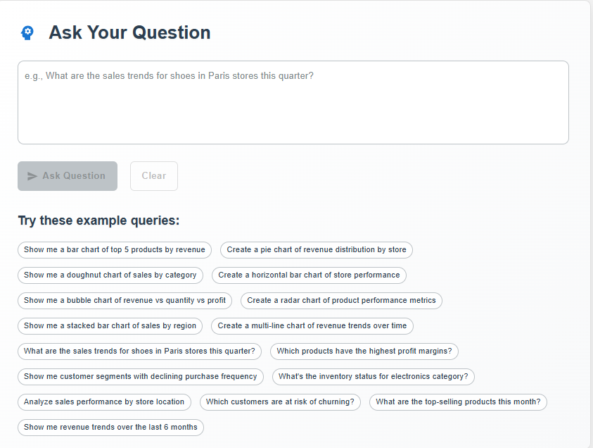
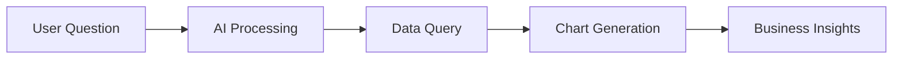

# GenAI Data Insights Platform

_Ask questions in plain English, get instant business insights_

## The Problem

Business teams spend hours creating reports and dashboards. Data analysts are overwhelmed with requests. Decision-makers wait days for insights. Traditional BI tools require SQL knowledge and complex setup.

**This platform solves that.**

## What It Does

Ask questions like:

- "Why are sales down in Paris?"
- "Show me top products by revenue"
- "What's our customer retention trend?"

Get instant answers with charts and insights - no SQL, no waiting, no technical skills needed.

## Platform Screenshots




## How It Works



1. **Ask** - Type your question in plain English
2. **Process** - AI converts it to data queries
3. **Visualize** - Automatic chart generation
4. **Insight** - AI explains what the data means

## Quick Start

### 1. Setup

```bash
git clone https://github.com/yourusername/genai-data-insights-platform.git
cd genai-data-insights-platform
cp env.example .env
# Add your OpenAI API key to .env
```

### 2. Run

```bash
docker-compose up -d
```

### 3. Use

- Open http://localhost:3000
- Ask a question
- Get insights instantly

## Features

- **Natural Language Queries** - Ask in plain English
- **10+ Chart Types** - Automatic visualization selection
- **Real-time Data** - Live business metrics
- **AI Insights** - Automated analysis and recommendations
- **No Setup Required** - Works out of the box

## Business Value

- **Faster Decisions** - Get insights in seconds, not days
- **Democratized Data** - Anyone can ask questions
- **Reduced Costs** - No need for dedicated BI teams
- **Better Insights** - AI finds patterns humans miss

## Technology

Built with modern, reliable tools:

- FastAPI backend
- React frontend
- ClickHouse for analytics
- OpenAI for natural language processing
- Docker for easy deployment

## License

Free license - use this for your business, modify as needed, no restrictions.

## Learn More

For detailed documentation, API reference, and advanced usage, see the [docs](docs/) folder.
