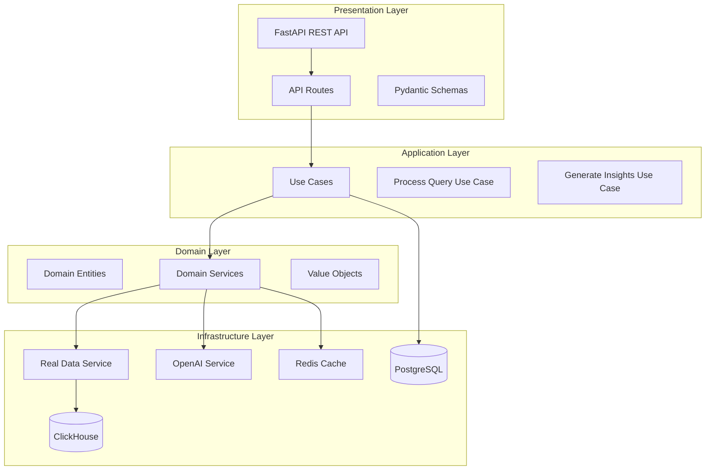
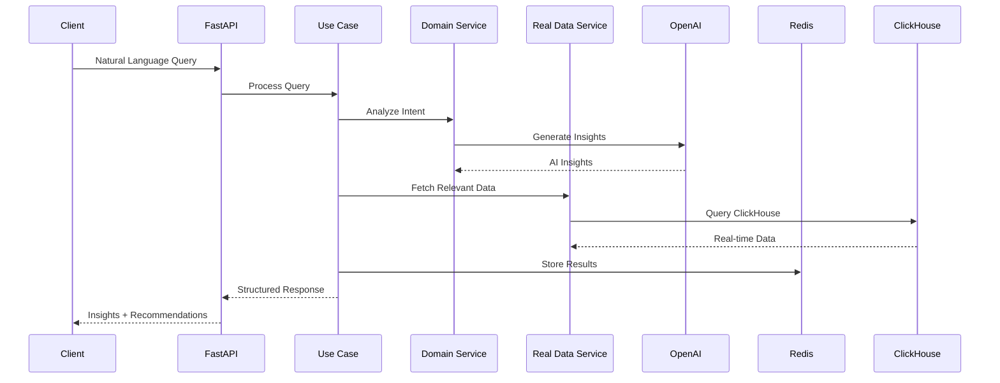
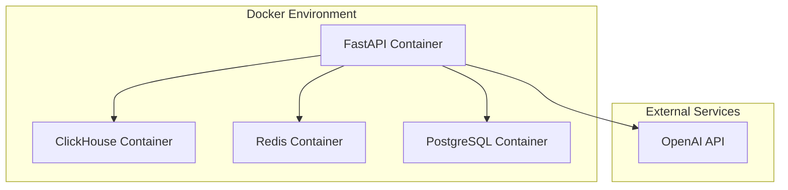

# Architecture

Technical architecture of the GenAI Data Insights Platform.

## Overview

The platform follows **Clean Architecture** principles with **Domain-Driven Design** (DDD), enabling natural language queries to be processed into actionable business insights using real-time data and AI.

## System Architecture



## Data Flow



## Layer Details

### 1. Presentation Layer

**FastAPI Application**

- **Port**: 8000
- **Features**: Async request handling, automatic OpenAPI docs
- **Routes**: `/api/v1/data/*`, `/api/v1/queries/*`
- **Validation**: Pydantic models for request/response validation

**Key Components:**

```python
# FastAPI app with CORS and middleware
app = FastAPI(title="GenAI Data Insights Platform")
app.add_middleware(CORSMiddleware, allow_origins=["http://localhost:3000"])

# Route registration
app.include_router(data_router)    # /api/v1/data/*
app.include_router(query_router)   # /api/v1/queries/*
```

### 2. Application Layer

**Use Cases** (Business Logic Orchestration)

- `ProcessQueryUseCase`: Main orchestrator for query processing
- Dependency injection for services and repositories
- Transaction management and error handling

**Key Implementation:**

```python
class ProcessQueryUseCase:
    def __init__(self, query_service, query_repo, insight_repo):
        self.query_service = query_service
        self.query_repo = query_repo
        self.insight_repo = insight_repo

    async def execute(self, query_text: str, user_id: str):
        # 1. Create query entity
        # 2. Analyze intent
        # 3. Generate insights
        # 4. Store results
        # 5. Return response
```

### 3. Domain Layer

**Entities** (Business Objects)

- `Query`: Natural language query with metadata
- `Insight`: AI-generated business insight
- `User`: User information and preferences

**Value Objects**

- `QueryText`: Validated query string
- `ConfidenceScore`: AI confidence (0.0-1.0)

**Domain Services**

- `QueryProcessingService`: Intent analysis and data context
- `InsightGenerationService`: AI-powered insight creation

### 4. Infrastructure Layer

**Data Services**

- `RealDataService`: ClickHouse integration for live analytics
- `OpenAIService`: GPT-4o Mini integration with structured output
- `CacheService`: Redis-based caching for performance

**Repositories**

- `QueryRepository`: PostgreSQL for query metadata
- `InsightRepository`: PostgreSQL for insight storage
- `UserRepository`: PostgreSQL for user management

## Data Architecture

### ClickHouse Data Warehouse

**Tables:**

```sql
-- Sales transactions
CREATE TABLE sales_data (
    date Date,
    product String,
    store String,
    quantity_sold Int32,
    revenue Float64,
    profit Float64
);

-- Inventory levels
CREATE TABLE inventory_data (
    product String,
    store String,
    current_stock Int32,
    reorder_level Int32,
    supplier String
);

-- Customer profiles
CREATE TABLE customer_data (
    customer_id String,
    name String,
    email String,
    age_group String,
    total_purchases Float64,
    last_purchase Date
);
```

### PostgreSQL Metadata

**Tables:**

```sql
-- Query tracking
CREATE TABLE queries (
    id SERIAL PRIMARY KEY,
    text TEXT NOT NULL,
    user_id VARCHAR(255),
    processed BOOLEAN DEFAULT FALSE,
    created_at TIMESTAMP DEFAULT NOW()
);

-- Insight storage
CREATE TABLE insights (
    id SERIAL PRIMARY KEY,
    query_id INTEGER REFERENCES queries(id),
    title VARCHAR(255),
    description TEXT,
    confidence_score FLOAT,
    data_sources TEXT[]
);
```

## AI Processing Pipeline

### 1. Query Intent Analysis

```python
def analyze_query_intent(self, query_text: str) -> Dict[str, Any]:
    # Use OpenAI to determine query intent
    response = self.openai_client.chat.completions.create(
        model="gpt-4o-mini",
        response_model=QueryIntent,
        messages=[
            {"role": "system", "content": "Analyze business query intent"},
            {"role": "user", "content": query_text}
        ]
    )
    return response.model_dump()
```

### 2. Data Context Retrieval

```python
def get_data_context(self, query_text: str) -> Dict[str, Any]:
    # Determine relevant data sources
    if "sales" in query_text.lower():
        return self.get_sales_data(7)  # Last 7 days
    elif "inventory" in query_text.lower():
        return self.get_inventory_data()
    # ... other data types
```

### 3. Insight Generation

```python
def generate_insights(self, query_text: str, data_context: Dict) -> List[Insight]:
    # Use OpenAI with structured output
    response = self.instructor_client.chat.completions.create(
        model="gpt-4o-mini",
        response_model=InsightResponse,
        messages=[
            {"role": "system", "content": "Generate actionable business insights"},
            {"role": "user", "content": f"Query: {query_text}\nData: {data_context}"}
        ]
    )
    return response.insights
```

## Caching Strategy

### Redis Implementation

**Cache Keys:**

- `genai:query:{query_hash}`: Query results (30 min TTL)
- `genai:insights:{query_id}`: Generated insights (2 hour TTL)
- `genai:data:{endpoint}`: Data endpoint responses (15 min TTL)

**Cache Service:**

```python
class CacheService:
    def __init__(self):
        self.redis_client = redis.from_url(REDIS_URL)
        self.default_ttl = 3600  # 1 hour

    def get_cached_query(self, query_hash: str) -> Optional[Dict]:
        return self.redis_client.get(f"genai:query:{query_hash}")

    def cache_query_result(self, query_hash: str, result: Dict):
        self.redis_client.setex(
            f"genai:query:{query_hash}",
            self.default_ttl,
            json.dumps(result)
        )
```

## Security & Monitoring

### Input Validation

- **Pydantic Models**: Request/response validation
- **SQL Injection Protection**: Parameterized queries
- **Rate Limiting**: Per-user and per-IP limits

### Logging & Monitoring

```python
# Structured logging
logger.info("Processing query", extra={
    "user_id": user_id,
    "query_length": len(query_text),
    "processing_time": processing_time
})

# Health checks
@app.get("/api/v1/data/health")
async def health_check():
    return {
        "service": "real_data",
        "status": "healthy",
        "timestamp": datetime.now().isoformat()
    }
```

## Performance Characteristics

### Response Times

- **Simple Data Queries**: < 500ms
- **Complex AI Queries**: < 2 seconds
- **Cached Responses**: < 100ms

### Throughput

- **Data Endpoints**: 1000+ requests/minute
- **AI Query Processing**: 100+ requests/minute
- **Concurrent Users**: 50+ simultaneous users

### Scalability

- **Horizontal Scaling**: Stateless FastAPI workers
- **Database Scaling**: ClickHouse cluster ready
- **Cache Scaling**: Redis cluster support

## Deployment Architecture



**Docker Compose Services:**

- `backend`: FastAPI application (port 8000)
- `clickhouse`: Data warehouse (port 8123)
- `redis`: Caching layer (port 6379)
- `postgresql`: Metadata storage (port 5432)

## Technology Stack

| Component            | Technology         | Version  | Purpose                           |
| -------------------- | ------------------ | -------- | --------------------------------- |
| **API Framework**    | FastAPI            | 0.104+   | High-performance async API        |
| **Data Warehouse**   | ClickHouse         | 23.8+    | Real-time analytics               |
| **Cache**            | Redis              | 7.0+     | Performance optimization          |
| **Database**         | PostgreSQL         | 15+      | Metadata storage                  |
| **AI/LLM**           | OpenAI GPT-4o Mini | Latest   | Natural language processing       |
| **Containerization** | Docker             | 24+      | Deployment and orchestration      |
| **Validation**       | Pydantic           | 2.0+     | Data validation and serialization |
| **Logging**          | Python logging     | Built-in | Structured logging                |

## Future Enhancements

1. **Authentication**: JWT-based user authentication
2. **Rate Limiting**: Advanced rate limiting with Redis
3. **Monitoring**: Prometheus metrics and Grafana dashboards
4. **Data Pipeline**: Kafka + Airflow for real-time data ingestion
5. **Frontend**: React-based query interface
6. **Multi-tenancy**: Support for multiple organizations
