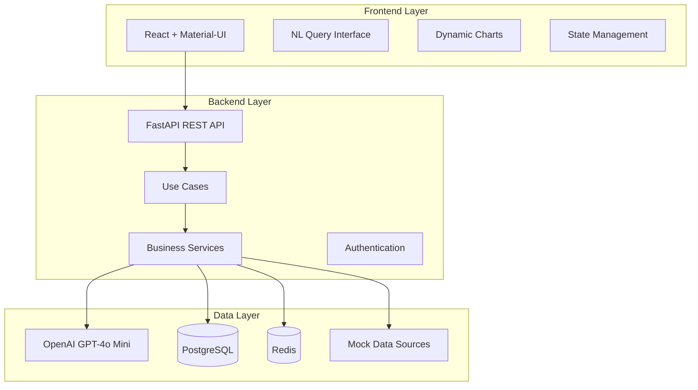
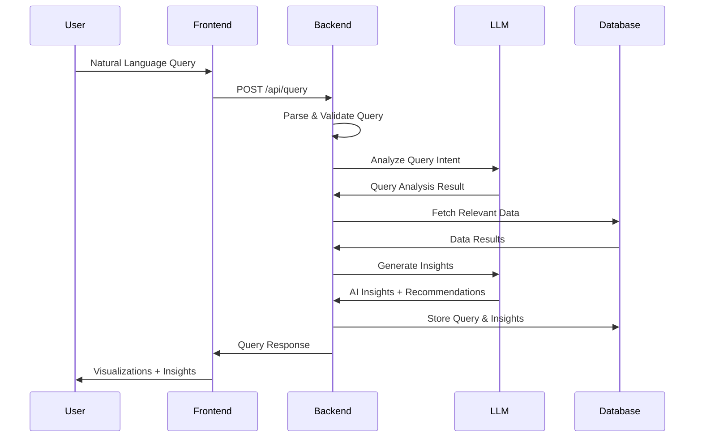

# Implementation Guide

## 🏗️ System Architecture



## 📁 Project Structure

```
genai-data-insights-platform/
├── backend/
│   ├── app/
│   │   ├── domain/
│   │   │   ├── entities/
│   │   │   │   ├── query.py
│   │   │   │   ├── insight.py
│   │   │   │   └── user.py
│   │   │   └── value_objects/
│   │   │       ├── query_type.py
│   │   │       └── insight_type.py
│   │   ├── application/
│   │   │   ├── use_cases/
│   │   │   │   ├── process_query.py
│   │   │   │   ├── generate_insights.py
│   │   │   │   └── create_visualization.py
│   │   │   └── services/
│   │   │       ├── llm_service.py
│   │   │       ├── analytics_service.py
│   │   │       └── visualization_service.py
│   │   ├── infrastructure/
│   │   │   ├── repositories/
│   │   │   │   ├── query_repository.py
│   │   │   │   └── insight_repository.py
│   │   │   └── external/
│   │   │       ├── openai_client.py
│   │   │       └── mock_data_service.py
│   │   └── presentation/
│   │       ├── routes/
│   │       │   ├── query_routes.py
│   │       │   └── insight_routes.py
│   │       └── schemas/
│   │           ├── query_schemas.py
│   │           └── insight_schemas.py
│   ├── requirements.txt
│   └── main.py
├── frontend/
│   ├── src/
│   │   ├── components/
│   │   │   ├── QueryInterface/
│   │   │   ├── Visualization/
│   │   │   └── Dashboard/
│   │   ├── services/
│   │   │   ├── api.ts
│   │   │   └── types.ts
│   │   └── hooks/
│   │       └── useQuery.ts
│   └── package.json
├── docker-compose.yml
└── docs/
```

## 🔄 Data Flow



## 📊 Mock Data Schema

```mermaid
erDiagram
    STORES {
        int store_id PK
        string name
        string location
        string region
    }

    PRODUCTS {
        int product_id PK
        string name
        string category
        float price
        int supplier_id FK
    }

    SALES {
        int sale_id PK
        int store_id FK
        int product_id FK
        int quantity
        float revenue
        datetime sale_date
    }

    INVENTORY {
        int inventory_id PK
        int store_id FK
        int product_id FK
        int quantity
        datetime last_updated
    }

    CUSTOMERS {
        int customer_id PK
        string name
        string email
        string region
    }

    STORES ||--o{ SALES
    PRODUCTS ||--o{ SALES
    STORES ||--o{ INVENTORY
    PRODUCTS ||--o{ INVENTORY
```

## 🎯 Implementation Phases

### Phase 1: Foundation Setup

- [ ] Project structure setup
- [ ] Docker configuration
- [ ] Database schema design
- [ ] Basic FastAPI setup
- [ ] React frontend setup

### Phase 2: Core Backend

- [ ] Domain entities and value objects
- [ ] Use cases implementation
- [ ] Repository pattern
- [ ] Basic API endpoints
- [ ] Mock data generation

### Phase 3: LLM Integration

- [ ] OpenAI client setup
- [ ] Query analysis service
- [ ] Insight generation service
- [ ] Prompt engineering
- [ ] Response formatting

### Phase 4: Frontend Development

- [ ] Natural language query interface
- [ ] Basic chart visualization
- [ ] Dashboard layout
- [ ] API integration
- [ ] State management

### Phase 5: Client Requirements

- [ ] Drill-down capability
- [ ] Audit logging system
- [ ] Basic error handling
- [ ] Documentation
- [ ] Deployment setup

## 🛠️ Technical Specifications

### Backend Requirements

- **FastAPI**: Modern async web framework
- **PostgreSQL**: Primary database with JSON support
- **Redis**: Caching and session storage
- **Pydantic**: Data validation and serialization
- **SQLAlchemy**: ORM for database operations
- **Alembic**: Database migrations

### Frontend Requirements

- **React 18**: Modern React with hooks
- **TypeScript**: Type safety
- **Material-UI**: Component library
- **Axios**: HTTP client

### AI/ML Requirements

- **OpenAI GPT-4o Mini**: Primary LLM
- **Custom prompts**: Domain-specific prompting

## 🔧 Development Guidelines

### Code Quality

- **Type hints**: Mandatory for all functions
- **Docstrings**: Comprehensive documentation
- **Clean architecture**: Strict layer separation
- **SOLID principles**: Maintainable code structure
- **Error handling**: Graceful failure management

### Performance

- **Async/await**: Non-blocking operations
- **Basic caching**: Redis for frequent queries
- **Database optimization**: Indexed queries

### Security

- **Input validation**: All user inputs validated
- **Rate limiting**: API protection
- **CORS**: Proper cross-origin handling
- **Environment variables**: Secure configuration

## 📈 Success Metrics

### Technical Metrics

- **Response time**: < 5 seconds for queries
- **Basic error handling**: Graceful failures
- **Working functionality**: Core features operational

### Business Metrics (Client Requirements)

- **Reduction in time**: From days to minutes for insights
- **Query accuracy**: Relevant AI-generated responses
- **Audit compliance**: Complete query and insight logging
